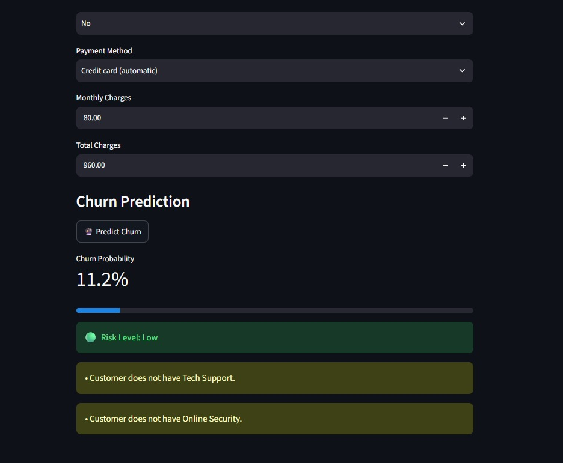
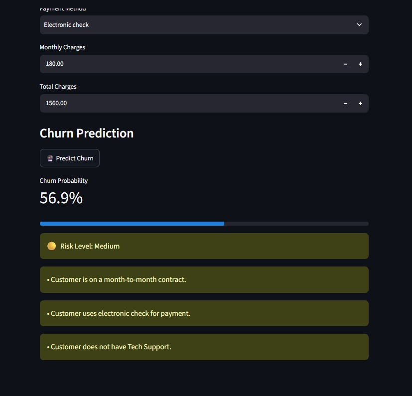
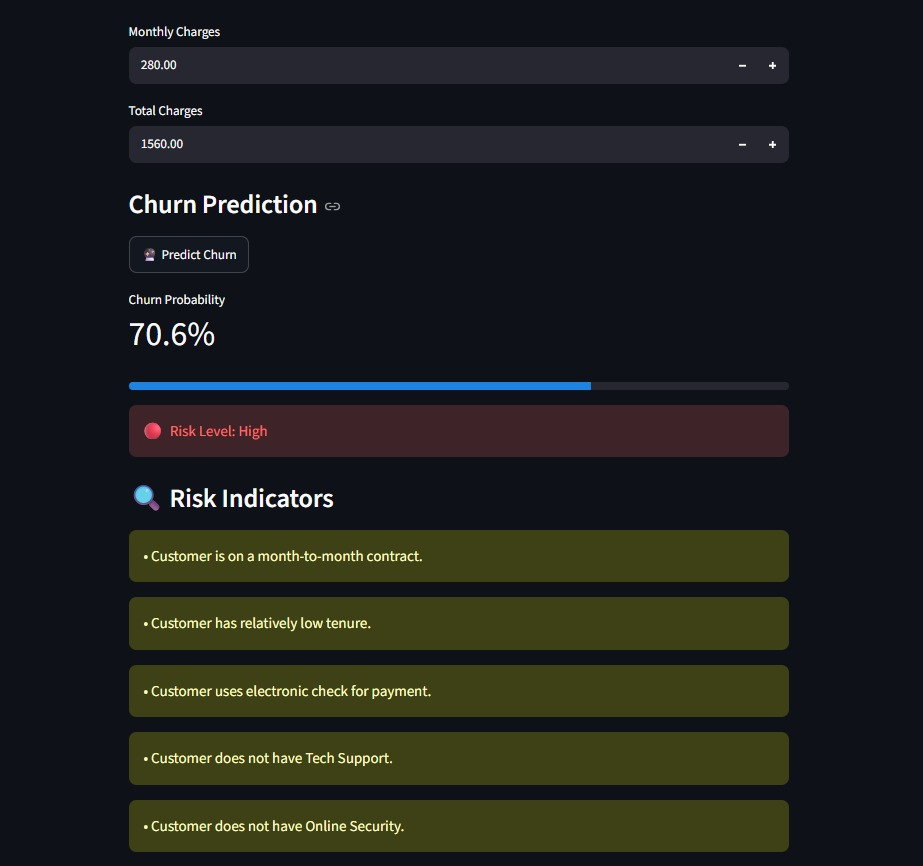

# 📊 Customer Churn Prediction

An end-to-end Machine Learning project that predicts whether a customer is likely to churn.

The project includes data preprocessing, exploratory data analysis, feature engineering, machine learning model training, model evaluation, and an interactive Streamlit dashboard for customer churn prediction.

---

## 📌 Project Overview

Customer churn occurs when a customer stops using a company's services.

The goal of this project is to use customer information such as:

- Customer demographics
- Tenure
- Internet service
- Contract type
- Payment method
- Monthly charges
- Total charges
- Support services

to predict the probability that a customer will churn.

---

## 🔄 Project Workflow

```text
Raw Customer Data
        ↓
Data Understanding
        ↓
Data Cleaning
        ↓
Exploratory Data Analysis
        ↓
Feature Engineering
        ↓
Train/Test Split
        ↓
Data Preprocessing
        ↓
Model Training
        ↓
Model Comparison
        ↓
Random Forest Hyperparameter Tuning
        ↓
Threshold Tuning
        ↓
Final Model
        ↓
Streamlit Dashboard
        ↓
Customer Churn Prediction
```

---

## 📊 Dashboard Examples

The project includes an interactive Streamlit dashboard that predicts customer churn probability and displays the customer's risk level.

### 🟢 Low Risk



### 🟡 Medium Risk



### 🔴 High Risk



---

## 📈 Model Performance

The final Random Forest model was evaluated using the following metrics:

| Metric | Score |
|---|---:|
| Accuracy | 78.4% |
| Precision | 58.5% |
| Recall | 64.7% |
| F1 Score | 61.4% |
| ROC-AUC | 84.4% |

The final churn classification threshold was set to **0.40** to improve the balance between identifying customers likely to churn and avoiding unnecessary false predictions.

---

## 🌲 Final Model

The final model used in this project is a **Random Forest Classifier**.

### Hyperparameters

```text
n_estimators = 200
max_depth = 10
min_samples_split = 2
min_samples_leaf = 2
random_state = 42
```

---

## 🧠 Model Development

Several machine learning models were evaluated during the project, including:

- Logistic Regression
- Decision Tree
- Random Forest

Random Forest achieved the best overall performance based on ROC-AUC and was selected as the final model.

Hyperparameter tuning was performed using **GridSearchCV** with ROC-AUC as the scoring metric.

---

## 🎯 Final Prediction Threshold

The default classification threshold was initially **0.50**.

After threshold analysis, a threshold of **0.40** was selected for the final model.

This threshold helps identify more customers who are likely to churn while maintaining a reasonable balance between precision and recall.

The dashboard uses this threshold to classify customers into churn or non-churn predictions.

---

## 🌐 Streamlit Dashboard

An interactive Streamlit dashboard was developed to allow users to enter customer information and receive a churn prediction.

The dashboard provides:

- Customer information input
- Service information input
- Contract and billing information
- Churn probability
- Risk level
- Risk indicators
- Final churn prediction

### Risk Levels

| Churn Probability | Risk Level |
|---|---|
| Below 30% | 🟢 Low Risk |
| 30% – 60% | 🟡 Medium Risk |
| Above 60% | 🔴 High Risk |

---

## 📁 Project Structure

```text
customer-churn-prediction/
│
├── dashboard/
│   └── app.py
│
├── data/
│   └── raw/
│       └── Telco-Customer-Churn (2).csv
│
├── models/
│   └── customer_churn_model.pkl
│
├── notebooks/
│   ├── 1_data_understanding.ipynb
│   ├── Data_cleaning.ipynb
│   ├── EDA.ipynb
│   ├── Feature_Engineering.ipynb
│   └── Model_Building.ipynb
│
├── screenshots/
│   ├── low-risk.png
│   ├── medium-risk.png
│   └── high-risk.png
│
├── src/
│   └── predict.py
│
├── .gitignore
├── README.md
└── requirements.txt
```

---

## 🛠️ Technologies Used

- Python
- Pandas
- NumPy
- Scikit-learn
- Joblib
- Matplotlib
- Seaborn
- Jupyter Notebook
- Streamlit
- Git
- GitHub

---

## ▶️ How to Run the Project

### 1. Clone the repository

```bash
git clone https://github.com/durgaprasadmaddi7-jpg/customer-churn-prediction.git
```

### 2. Navigate to the project directory

```bash
cd customer-churn-prediction
```

### 3. Install the required dependencies

```bash
pip install -r requirements.txt
```

### 4. Run the Streamlit dashboard

```bash
streamlit run dashboard/app.py
```

The dashboard will open in your web browser.

---

## 🔮 Example Prediction

An example customer prediction produced the following result:

```text
Churn Probability: 60.9%
Prediction: 1
Result: Customer is likely to churn
```

A prediction of `1` indicates that the model predicts the customer is likely to churn.

A prediction of `0` indicates that the model predicts the customer is unlikely to churn.

---

## 🔍 Key Features

- Data understanding
- Data cleaning
- Exploratory Data Analysis
- Feature engineering
- Categorical feature encoding
- Feature scaling
- Multiple machine learning models
- Random Forest hyperparameter tuning
- ROC-AUC evaluation
- Churn probability prediction
- Classification threshold tuning
- Interactive Streamlit dashboard
- Low, Medium, and High risk indicators

---

## 🚀 Future Improvements

Possible future improvements include:

- Adding more advanced machine learning models
- Improving hyperparameter optimization
- Adding feature importance visualization
- Adding SHAP-based model explainability
- Adding customer segmentation
- Adding more dashboard visualizations
- Integrating real-time customer data
- Implementing automated model retraining
- Improving dashboard user experience

---

## ✅ Project Status

**Completed**

The project currently includes:

- ✅ Data understanding
- ✅ Data cleaning
- ✅ Exploratory data analysis
- ✅ Feature engineering
- ✅ Train/test split
- ✅ Data preprocessing
- ✅ Model training
- ✅ Model comparison
- ✅ Random Forest hyperparameter tuning
- ✅ Threshold tuning
- ✅ Final model
- ✅ Streamlit dashboard
- ✅ Dashboard risk-level examples
- ✅ GitHub documentation

---

## 👨‍💻 Author

**Durga Prasad**

This project was developed as an end-to-end Machine Learning project to understand the complete workflow from raw data to model deployment.